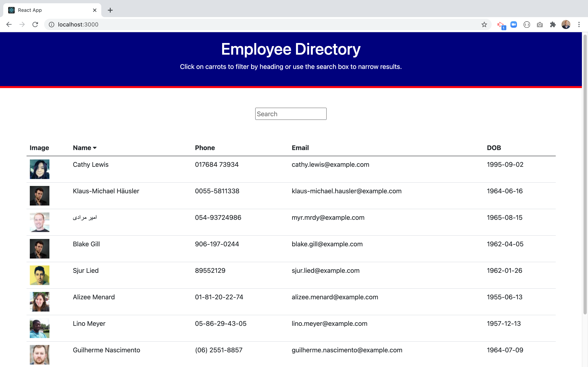
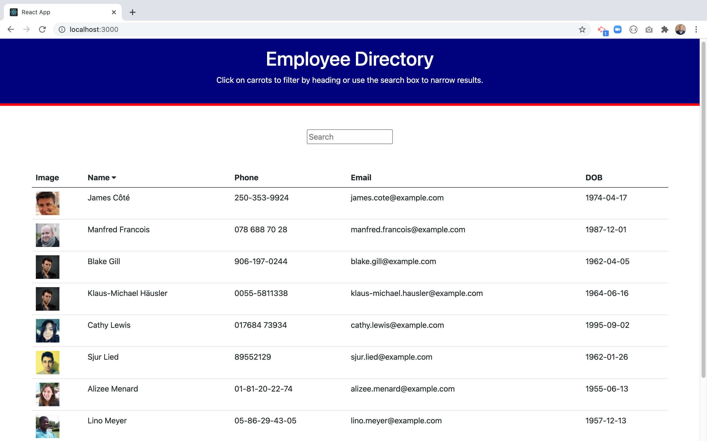
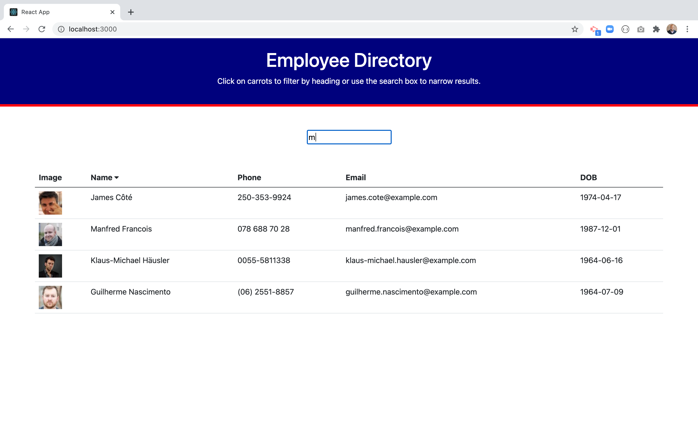

# User Directory

## Description
[User Directory](https://github.com/MarioReid/user-directory) was created to give users For this assignment, you'll create a employee directory with React. This assignment will require you to break up your application's UI into components, manage component state, and respond to user events.

User Directory
## Screenshots
 

## Table of Contents
* [Screenshots](#screenshots)
* [Installation](#installation)
* [Usage](#usage)
* [Credits](#credits)
* [License](#license)

## Installation

Open webpage using a browser of your choice.

## Usage

* Able to view my entire employee directory at once so that I have quick access to their information. 

## Credits
* [React](https://www.npmjs.com/package/react)

* [Axios](https://www.npmjs.com/package/axios)

* [w3schools](https://www.w3schools.com/html/html5_semantic_elements.asp)

* [Bootstrap](https://getbootstrap.com)

* [FontAwesome](https://fontawesome.com/)

* [Random User](https://randomuser.me/)

## License

MIT License
Copyright (c) 2021 Mario Reid
Permission is hereby granted, free of charge, to any person obtaining a copy
of this software and associated documentation files (the "Software"), to deal
in the Software without restriction, including without limitation the rights
to use, copy, modify, merge, publish, distribute, sublicense, and/or sell
copies of the Software, and to permit persons to whom the Software is
furnished to do so, subject to the following conditions:
The above copyright notice and this permission notice shall be included in all
copies or substantial portions of the Software.
THE SOFTWARE IS PROVIDED "AS IS", WITHOUT WARRANTY OF ANY KIND, EXPRESS OR
IMPLIED, INCLUDING BUT NOT LIMITED TO THE WARRANTIES OF MERCHANTABILITY,
FITNESS FOR A PARTICULAR PURPOSE AND NONINFRINGEMENT. IN NO EVENT SHALL THE
AUTHORS OR COPYRIGHT HOLDERS BE LIABLE FOR ANY CLAIM, DAMAGES OR OTHER
LIABILITY, WHETHER IN AN ACTION OF CONTRACT, TORT OR OTHERWISE, ARISING FROM,
OUT OF OR IN CONNECTION WITH THE SOFTWARE OR THE USE OR OTHER DEALINGS IN THE
SOFTWARE.